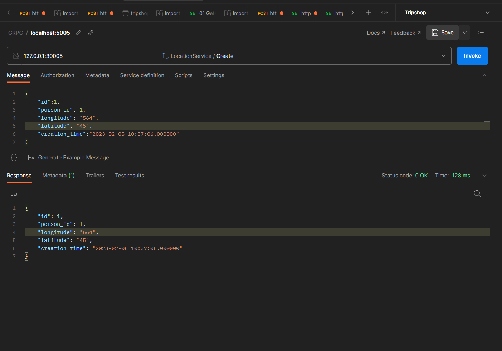

# Locations Update GRPC Request
- In location producer we have only on gRPC API calls for receiving Locations updates and push it to Kafka 
- We can push updates by invoking Create On Locations Service with sample request below
```json
{
    "id":1,
    "person_id": 1,
    "longitude": "564",
    "latitude": "45",
    "creation_time":"2023-02-05 10:37:06.000000"
}
```
- Postman Example
